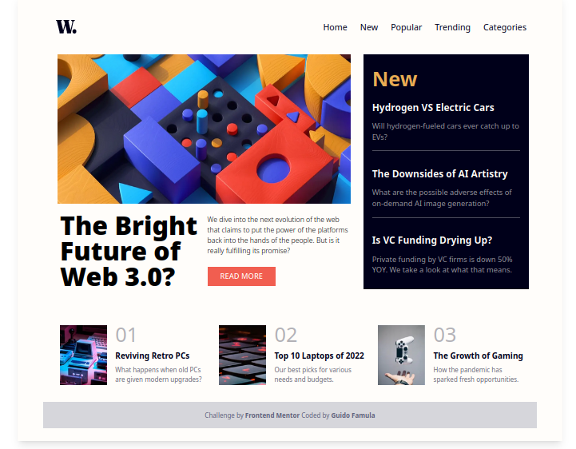
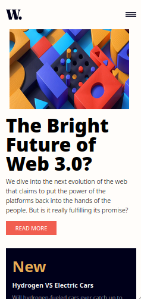

# Frontend Mentor - News homepage solution

This is a solution to the [News homepage challenge on Frontend Mentor](https://www.frontendmentor.io/challenges/news-homepage-H6SWTa1MFl). Frontend Mentor challenges help you improve your coding skills by building realistic projects.

## Table of contents

- [Overview](#overview)
  - [The challenge](#the-challenge)
  - [Screenshot](#screenshot)
  - [Links](#links)
- [My process](#my-process)
  - [Built with](#built-with)
  - [Useful resources](#useful-resources)
- [Author](#author)

**Note: Delete this note and update the table of contents based on what sections you keep.**

## Overview

### The challenge

Users should be able to:

- View the optimal layout for the interface depending on their device's screen size
- See hover and focus states for all interactive elements on the page
- **Bonus**: Toggle the mobile menu (work with useState on React)

### Screenshot

**Desktop View** 

**Mobile View**

### Links

- Live Site URL: [Challenge 01](https://challenge01-amber.vercel.app/)

## My process

### Built with

- [React](https://reactjs.org/) - JS library
- [Next.js](https://nextjs.org/) - React framework
- [Tailwind CSS](https://tailwindcss.com/) - For styles

### Useful resources

- [Tailwind CSS - Core Concepts](https://tailwindcss.com/docs/hover-focus-and-other-states) - This helped me for handling hover, focus, and other states, using utilities to style elements on hover, focus, and more. I really liked this pattern and will use it going forward.
- [Next JS - How to setup in styling](https://nextjs.org/learn/basics/assets-metadata-css) - This is an amazing article which helped me finally understand assets, metadata and CSS. I'd recommend it to anyone still learning this concept.

## Author

- Website - [GUIDOFAMULA.COm](https://www.guidofamula.com)
- Frontend Mentor - [@guidofamula](https://www.frontendmentor.io/profile/guidofamula)
- Linkedin - [Guido Famula](https://www.linkedin.com/in/guido-famula/)
